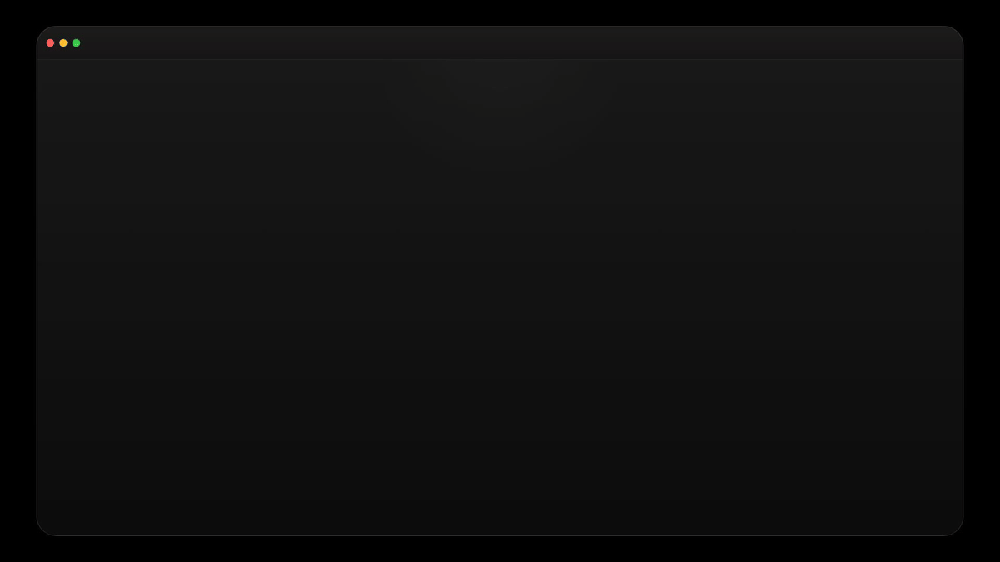
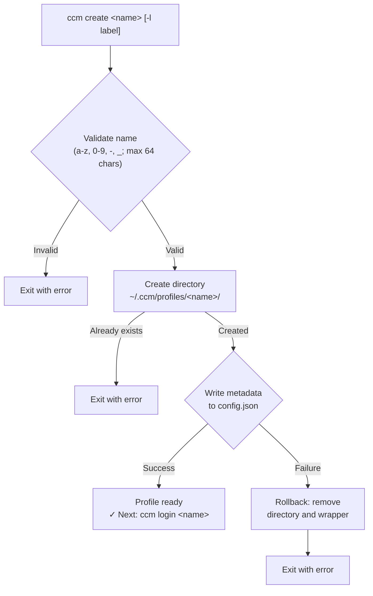
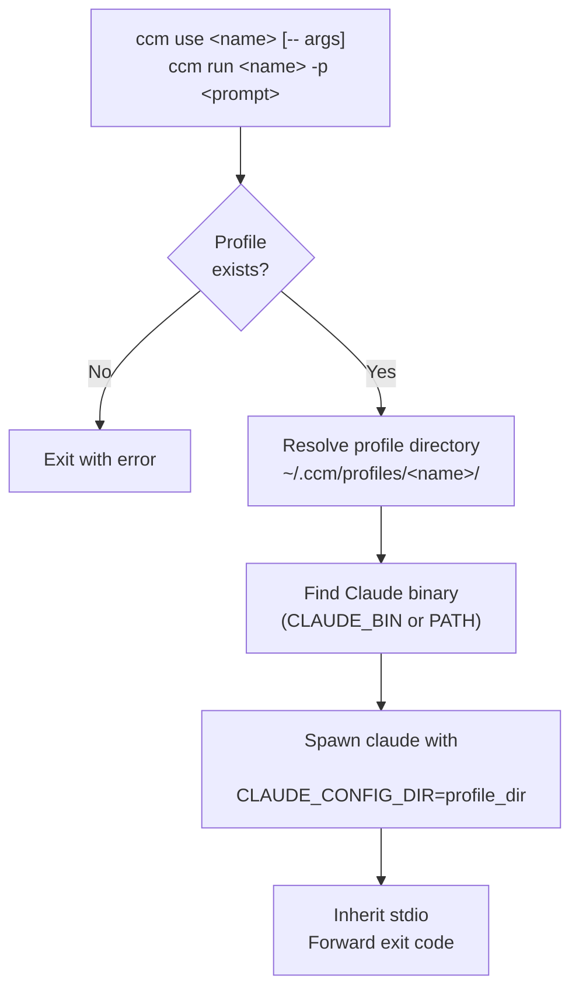
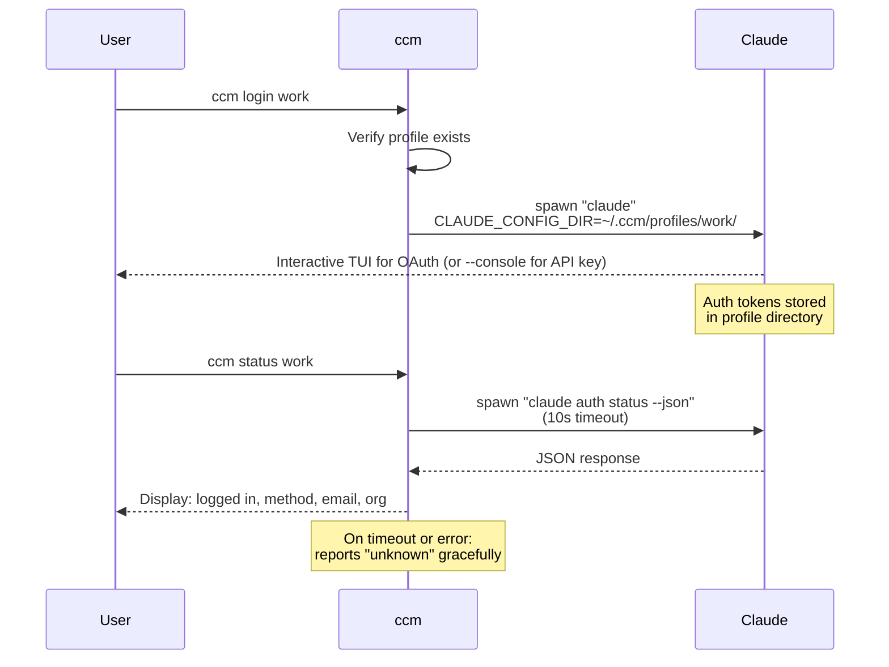
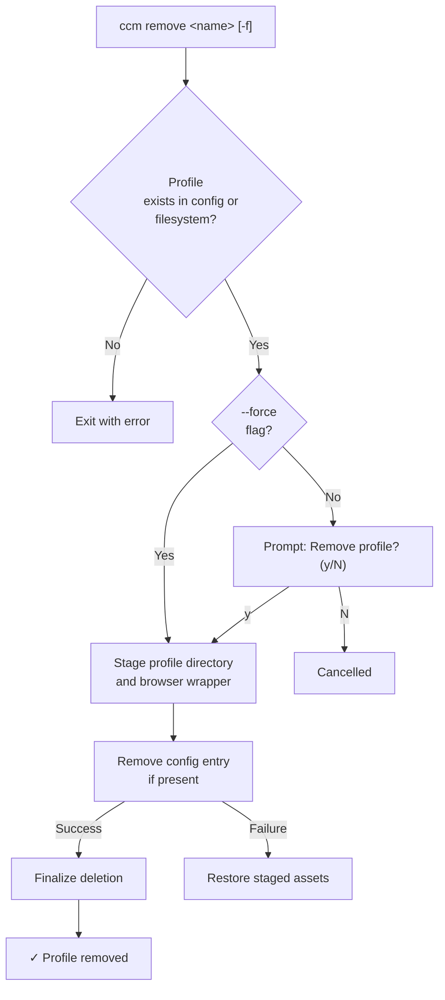

<div id="toc">
  <table>
    <tr>
      <td width="170" valign="top">
        
      </td>
      <td valign="middle">
        <h1 align="left">ccm</h1>
        <p><strong>Multi-profile manager for Claude Code</strong></p>
        <p>Switch between Claude Code accounts instantly. Like <code>nvm</code> for Claude Code profiles.</p>
      </td>
    </tr>
  </table>
</div>


[](https://github.com/remeic/ccm/actions/workflows/ci.yml)
[](https://www.npmjs.com/package/@remeic/ccm)
[](https://github.com/Remeic/homebrew-tap)
[](LICENSE)
[](https://nodejs.org)
[](https://codecov.io/github/Remeic/ccm)
[](https://dashboard.stryker-mutator.io/reports/github.com/Remeic/ccm/main)

Manage separate Claude Code profiles for personal, work, and client accounts without repeated logout/login cycles. `ccm` keeps each profile isolated so switching is immediate and parallel sessions stay clean.

### IMPORTANT: Claude Code ToS (Multi-Terminal Use)

> [!IMPORTANT]
> **Mandatory compliance rule for this project**
> Do **not** use the **same Claude account** from multiple terminals at the same time.
> We enforce: **1 account = 1 person = 1 active terminal session**.
>
> - `ccm` isolates profiles. It does **not** grant any extra rights under Anthropic terms.
> - For parallel work, use separate licensed accounts/seats (or API keys under Commercial Terms).
> - No credential sharing, no shared account handoff, no "one account used by multiple people".
> - This is an intentionally strict project rule to remove ambiguity and reduce compliance risk.
> - The CLI also surfaces this via `ccm compliance` (alias: `ccm tos`) and after every successful `ccm create`.
>
> Official basis (as of April 8, 2026):
> - [Claude Code Legal & Compliance](https://code.claude.com/docs/en/legal-and-compliance): usage limits for Pro/Max assume ordinary, individual use; Anthropic may enforce auth restrictions without notice.
> - [Anthropic Consumer Terms](https://www.anthropic.com/legal/consumer-terms): account credentials/API keys must not be shared or made available to others; Anthropic may suspend/terminate for material breach.
> - [Anthropic Commercial Terms](https://www.anthropic.com/legal/commercial-terms): customer is responsible for all activity under its account.


<p align="center">
  
</p>

## Table of Contents

- [Table of Contents](#table-of-contents)
- [Why](#why)
- [Prerequisites](#prerequisites)
- [Install](#install)
- [Quick Start](#quick-start)
- [Commands](#commands)
- [Compliance Notice](#compliance-notice)
- [Scripting (JSON Output)](#scripting-json-output)
- [Shell Completion](#shell-completion)
- [Passing Flags and Environment Variables](#passing-flags-and-environment-variables)
- [Multi-Account Login](#multi-account-login)
  - [Different Browser per Profile](#different-browser-per-profile)
  - [URL-Only Mode](#url-only-mode)
  - [API Key Auth](#api-key-auth)
  - [Copying Config Between Profiles](#copying-config-between-profiles)
- [How It Works](#how-it-works)
  - [Architecture Overview](#architecture-overview)
  - [Profile Isolation](#profile-isolation)
  - [Profile Lifecycle](#profile-lifecycle)
  - [Launching Claude](#launching-claude)
  - [Authentication](#authentication)
  - [Removing Profiles](#removing-profiles)
  - [Config Persistence](#config-persistence)
  - [Claude Binary Discovery](#claude-binary-discovery)
- [Configuration](#configuration)
- [Privacy](#privacy)
- [Comparison](#comparison)
- [FAQ](#faq)
- [Contributing](#contributing)
  - [Homebrew Releases](#homebrew-releases)
- [License](#license)

## Why

Claude Code stores authentication in a single config directory. If you use multiple Anthropic accounts (personal, work, client projects), you need to log out and back in every time you switch. **ccm** manages isolated profile directories so you can switch instantly — or run multiple accounts simultaneously.

## Prerequisites

- [Node.js](https://nodejs.org) >= 24
- [Claude Code](https://docs.anthropic.com/en/docs/claude-code) installed and available on your `PATH`

## Install

```sh
npm install -g @remeic/ccm
pnpm add -g @remeic/ccm
yarn global add @remeic/ccm
bun add -g @remeic/ccm
brew install remeic/tap/ccm
```

Homebrew core already ships an unrelated `ccm` formula, so install this one with the fully qualified tap name.

```sh
npx @remeic/ccm <command>
pnpm dlx @remeic/ccm <command>
yarn dlx @remeic/ccm <command>
bunx @remeic/ccm <command>
```

The installed command remains `ccm`.

## Quick Start

```
$ ccm create work
✓ Profile "work" created
! Compliance notice
  ccm isolates profiles but does not expand Anthropic usage rights.
  Use each Claude account with one person and one active terminal session.
  Do not share credentials or API keys across users or parallel operators.
  Details: ccm compliance
  Next: ccm login work

$ ccm login work
# Opens Claude auth flow in browser...

$ ccm use work
# Launches Claude Code with the "work" profile
```

## Commands

| Command                                                  | Description                                                   |
| -------------------------------------------------------- | ------------------------------------------------------------- |
| `ccm create <name> [-l label] [-b browser] [--from p]`   | Create a profile. `--from` seeds non-auth config              |
| `ccm compliance` / `ccm tos`                             | Show the compliance notice, disclaimer, and official sources  |
| `ccm list [--json]`                                      | List all profiles with auth status, including drifted entries. `--json` for scripts |
| `ccm use <name> [args...]`                               | Launch Claude Code. Extra args are passed to Claude            |
| `ccm login <name> [--console] [-b browser] [--url-only]` | Authenticate a profile                                        |
| `ccm status [name] [--json]`                             | Show auth status and storage state for one or all profiles. `--json` for scripts |
| `ccm rename <old-name> <new-name>`                       | Rename a profile (config, directory, and browser wrapper)     |
| `ccm remove <name> [-f]`                                 | Remove a profile. `-f` skips confirmation                     |
| `ccm copy-config <source> <target> [--only x] [--dry-run] [-f]` | Copy non-auth config (settings/hooks/skills plugins) |
| `ccm run <name> -p <prompt>`                             | Run a prompt non-interactively                                |
| `ccm skills <add\|list\|remove\|update> <name> [repos...]` | Manage skills scoped to a profile (wraps `npx skills`)       |
| `ccm completion <bash\|zsh\|fish>`                       | Print a shell completion script                               |

## Compliance Notice

Every successful `ccm create` prints a short compliance warning. Users can re-open the full text at any time with:

```bash
ccm compliance
ccm tos
```

The notice is intentionally conservative:

- `ccm` is a profile-isolation tool, not a license-expansion tool.
- This project treats each Claude account as single-user and single-session.
- Shared credentials, shared operators, and parallel use of the same account are out of scope.
- If a team needs parallel access, they should use separate seats/accounts or API-key-based access under applicable Anthropic commercial terms.
- The notice is compliance guidance, not legal advice. Users remain responsible for reviewing Anthropic terms for their exact workflow.

## Scripting (JSON Output)

`ccm list` and `ccm status` accept `--json` for machine-readable output you can pipe into `jq` or
other tooling. Color is automatically disabled when output is not a TTY (or when `NO_COLOR` is set),
so human-facing commands stay clean in pipes and logs.

```bash
# All profiles as JSON
ccm list --json | jq '.[] | select(.loggedIn) | .name'

# A single profile
ccm status work --json | jq '.account'
```

Each entry: `{ name, state, authMethod, account, loggedIn, createdAt, hasConfig, hasDirectory }`.
Unknown values are `null` (never the `—` placeholder used in the human table).

## Shell Completion

`ccm completion <shell>` prints a completion script. The command list is derived from the live
command registry, so it never drifts as commands are added.

```bash
# zsh
ccm completion zsh > "${fpath[1]}/_ccm"

# bash
ccm completion bash >> ~/.bashrc

# fish
ccm completion fish > ~/.config/fish/completions/ccm.fish
```

## Passing Flags and Environment Variables

Extra args in `ccm use` are forwarded to `claude` (with or without the `--` separator). Env vars from your shell are inherited.

```bash
# Pass flags
ccm use work --resume e56f8bd7-a2bb-4c0e-9aa0-3eb7f717bf6a

# Pass flags (explicit separator)
ccm use work -- --dangerously-skip-permissions

# Env vars + flags
CLAUDE_CODE_EXPERIMENTAL_AGENT_TEAMS=1 ccm use work -- --dangerously-skip-permissions

# Non-interactive with env vars
CLAUDE_CODE_EXPERIMENTAL_AGENT_TEAMS=1 ccm run work -p "explain this codebase"
```

For combos you use often, set up shell aliases:

```bash
# ~/.zshrc or ~/.bashrc
alias cwork='CLAUDE_CODE_EXPERIMENTAL_AGENT_TEAMS=1 ccm use work -- --dangerously-skip-permissions'
alias cpersonal='ccm use personal -- --dangerously-skip-permissions'
```

## Multi-Account Login

Each profile has isolated auth. Claude Code manages credentials in macOS Keychain; ccm stores nothing.

`ccm login` launches the interactive Claude TUI which supports both auto-redirect (localhost callback) and manual code paste.

### Different Browser per Profile

```bash
# Specify browser for this login
ccm login work --browser firefox

# Persist browser in the profile
ccm create work --browser "/Applications/Google Chrome.app/Contents/MacOS/Google Chrome"
ccm login work  # always opens Chrome

# Chrome with a specific profile directory
ccm create client --browser "/Applications/Google Chrome.app/Contents/MacOS/Google Chrome --profile-directory=Profile\ 2"
```

### URL-Only Mode

```bash
ccm login work --url-only
```

Suppresses auto-opening a browser. Claude prints the auth URL — copy it, open in whichever browser you want. After ~3 seconds the TUI shows "Paste code here if prompted >" where you paste the code from the browser.

### API Key Auth

```bash
ccm login work --console
```

### Managing Skills per Profile

`npx skills add <owner/repo>` installs into the global Claude Code dir (`~/.claude/skills`).
`ccm skills` runs the same `skills` tool but points `CLAUDE_CONFIG_DIR` at the profile, so
skills land in `<profile>/skills/` — isolated per profile, visible to every session of that
profile (the per-profile equivalent of `npx skills add -g`).

```bash
# Install skills from GitHub into a profile
ccm skills add work owner/repo

# Multiple repos + passthrough flags (forwarded to npx skills)
ccm skills add work a/b c/d --copy

# List / update / remove
ccm skills list work
ccm skills update work
ccm skills remove work my-skill
```

Requires network/npx cache (uses `npx -y skills`).

### Copying Config Between Profiles

```bash
# Preview before applying
ccm copy-config work personal --dry-run

# Copy with interactive overwrite confirmation
ccm copy-config work personal

# Force overwrite without prompt
ccm copy-config work personal --force

# Copy only settings (or only plugins)
ccm copy-config work personal --only settings
ccm copy-config work personal --only plugins
```

`copy-config` is intentionally conservative. It copies only non-auth profile config paths:

- `settings.json`
- `plugins/`

It does **not** copy runtime/auth state such as `.claude.json`, `sessions/`, `history.jsonl`,
`projects/`, `session-env/`, `telemetry/`, or top-level profile cache directories.

You can narrow the copy scope with `--only settings` or `--only plugins`. The option is repeatable and also supports comma-separated values (e.g. `--only settings,plugins`).

You can also bootstrap at creation time:

```bash
# Create profile and seed non-auth config from an existing profile
ccm create personal --from work
```

## How It Works

### Architecture Overview

ccm stores all data under `~/.ccm/`:

```
~/.ccm/
├── config.json              # Profile metadata (name, label, createdAt)
├── browsers/                # Browser wrapper scripts (when browser has args)
└── profiles/
    ├── work/                # Isolated Claude config directory
    └── personal/            # Isolated Claude config directory
```

Each profile directory acts as a standalone Claude Code config directory. A central `config.json` tracks metadata. Runtime dependencies are [Commander.js](https://github.com/tj/commander.js) for CLI parsing and [Zod](https://zod.dev) for schema validation and type inference; everything else uses Node.js built-ins.

Source code follows a clean separation between library logic and CLI wiring:

```
src/
├── index.ts                 # Entry point — registers all commands
├── types.ts                 # Zod schemas and inferred TypeScript types
├── lib/
│   ├── constants.ts         # Path constants (~/.ccm, profiles dir, config file)
│   ├── config.ts            # Config file I/O with atomic writes
│   ├── profiles.ts          # Profile directory management and validation
│   ├── profile-store.ts     # Reconciled config/filesystem profile view
│   ├── profile-config-copy.ts # Config copy planner + transactional apply/rollback
│   ├── profile-view.ts      # Serializable projection shared by list/status (incl. --json)
│   ├── claude.ts            # Claude binary discovery, spawning, auth status
│   ├── compliance.ts        # Centralized compliance notice text and official sources
│   ├── completion.ts        # Shell completion script generation (bash/zsh/fish)
│   ├── errors.ts            # Shared error-message formatting
│   ├── run-action.ts        # Wraps command actions with uniform error handling
│   ├── ui.ts                # Terminal output helpers (NO_COLOR/TTY-aware)
│   └── browsers.ts          # Browser wrapper generation and validation
└── commands/
    ├── completion.ts        # Emit a shell completion script
    ├── copy-config.ts       # Copy non-auth config between profiles (dry-run + rollback)
    ├── compliance.ts        # Dedicated compliance/TOS command
    ├── create.ts            # Create profile (with rollback on failure)
    ├── list.ts              # List profiles with auth status and drift state
    ├── login.ts             # Authenticate via Claude TUI or --console
    ├── use.ts               # Launch Claude with profile config dir
    ├── status.ts            # Show auth status and drift state
    ├── rename.ts            # Rename profile with atomic rollback
    ├── remove.ts            # Remove profile with staged rollback
    └── run.ts               # Run prompt with specific profile
```

For the design rationale behind the reconciled profile store and the transactional
staging/rollback used by remove, rename, and copy-config, see **[ARCHITECTURE.md](ARCHITECTURE.md)**.

### Profile Isolation

Claude Code reads auth tokens, settings, and project data from whatever directory `CLAUDE_CONFIG_DIR` points to. ccm exploits this by creating a separate directory per profile and setting this environment variable when spawning Claude:

```ts
spawn(claudeBinary, args, {
  env: { ...process.env, CLAUDE_CONFIG_DIR: profileDir },
  stdio: 'inherit',
})
```

No symlinks, no file copying, no modification of Claude's own config directory. Profiles are fully independent — logging in with one profile does not affect another. You can run multiple profiles simultaneously in different terminals.

### Profile Lifecycle

When you create a profile, ccm validates the name, creates the directory, creates a browser wrapper if needed, and writes metadata to `config.json`. If the config write fails, any partially created on-disk state is rolled back.



Profile names must match `[a-zA-Z0-9_-]+` and cannot exceed 64 characters.

`ccm list` and `ccm status` reconcile `config.json` with `~/.ccm/profiles/` instead of trusting just one source. Each profile is surfaced with one of these states:

- `ready`: config entry and profile directory both exist
- `orphaned`: directory exists but metadata is missing from `config.json`
- `config-only`: metadata exists but the profile directory is missing

### Launching Claude

Both `ccm use` and `ccm run` resolve the profile directory, locate the Claude binary, and spawn it with the isolated config.



`use` launches an interactive Claude session. Any args after `--` are passed through directly. `run` sends a prompt non-interactively via `-p`.

### Authentication

Login delegates entirely to Claude's own auth flow. OAuth launches the interactive Claude TUI directly; `--console` uses `claude auth login --console`. Status checks use `claude auth status --json` with a 10-second timeout.



The `--console` flag on `login` enables API key authentication instead of the browser flow.

### Removing Profiles

Removal deletes the config entry, the profile directory, and any browser wrapper script. By default, it asks for confirmation.

To avoid leaving config and filesystem out of sync, removal is staged: ccm temporarily renames on-disk assets, updates `config.json`, and only then finalizes deletion. If the config update fails, the staged assets are restored.



### Config Persistence

ccm uses an atomic write pattern to prevent config corruption. Data is written to a temporary file, then atomically renamed:

```ts
const tmp = `${configFile}.tmp`
writeFileSync(tmp, JSON.stringify(config, null, 2))
renameSync(tmp, configFile)  // Atomic on POSIX filesystems
```

If the process crashes mid-write, the original config file remains intact. The config schema:

```json
{
  "profiles": {
    "work": {
      "name": "work",
      "label": "Work account",
      "browser": "/path/to/browser",
      "createdAt": "2025-03-15T10:30:00.000Z"
    }
  }
}
```

On read errors (missing file, malformed JSON, invalid structure), ccm gracefully falls back to a default empty config rather than crashing.

### Claude Binary Discovery

ccm locates the Claude binary using the following strategy:

1. Check the `CLAUDE_BIN` environment variable (explicit override)
2. Use `which claude` (Unix/macOS) or `where claude` (Windows) to search `PATH`
3. If neither succeeds, exit with a clear installation message

## Configuration

| Variable     | Description                                                                                      |
| ------------ | ------------------------------------------------------------------------------------------------ |
| `CLAUDE_BIN` | Override the path to the Claude binary. Useful if Claude is installed in a non-standard location |

All ccm data is stored in `~/.ccm/`. This includes the config file and all profile directories.

## Privacy

**ccm does not collect, store, or transmit any user data.** There is no telemetry, no analytics, no network calls of any kind.

Everything stays on your machine:

- **Profile metadata** (name, label, creation date) is stored locally in `~/.ccm/config.json`
- **Auth tokens** are managed entirely by Claude Code inside each profile directory — ccm never reads or touches them
- **No outbound connections** — ccm only spawns the local Claude binary, it never contacts any remote server

You can verify this yourself: the runtime dependencies are [Commander.js](https://github.com/tj/commander.js) for CLI parsing and [Zod](https://zod.dev) for schema validation and type inference, and the CLI still makes zero HTTP requests.

## Comparison

|                    | Without ccm                                   | With ccm                        |
| ------------------ | --------------------------------------------- | ------------------------------- |
| Switch accounts    | `claude auth logout` then `claude auth login` | `ccm use work`                  |
| Multiple sessions  | Not possible simultaneously                   | Each profile runs independently |
| Config mixing risk | High — single config directory                | None — full isolation           |
| Setup per account  | Manual every time                             | One-time `create` + `login`     |

## FAQ

**Can I use two profiles at the same time?**

Yes. Each profile has its own config directory. Run `ccm use work` in one terminal and `ccm use personal` in another — they are fully independent.

**Does ccm modify Claude Code itself?**

No. ccm only sets the `CLAUDE_CONFIG_DIR` environment variable when spawning Claude. It never modifies Claude's files or installation.

**What happens if I delete `~/.ccm/`?**

All profiles and their auth tokens are lost. Claude Code itself is unaffected.

**Is Windows supported?**

ccm uses cross-platform binary discovery (`which`/`where`) and standard Node.js filesystem APIs. It works on macOS, Linux, and Windows.

## Contributing

### Homebrew Releases

Homebrew publication is handled through a dedicated tap, not `homebrew/core`. After `npm publish`, the release workflow updates `Formula/ccm.rb` in the tap repository.

To keep the release PR and changelog accurate, prefer **Squash and merge** with a Conventional Commit PR title like `feat: add profile import command`. `release-please` uses the merged commit on `main`, so `docs:` and `refactor:` changes are typically omitted from Node release notes while `feat:` and `fix:` become releasable entries.

Required repository configuration:

- `HOMEBREW_TAP_GITHUB_TOKEN`: GitHub token with write access to the tap repo
- `HOMEBREW_TAP_REPOSITORY`: optional repository override, defaults to `remeic/homebrew-tap`

Generate the formula locally:

```sh
bun run homebrew:formula -- --sha256 <npm-tarball-sha256> --output /tmp/ccm.rb
```

See [CONTRIBUTING.md](CONTRIBUTING.md).

## License

[MIT](LICENSE)
