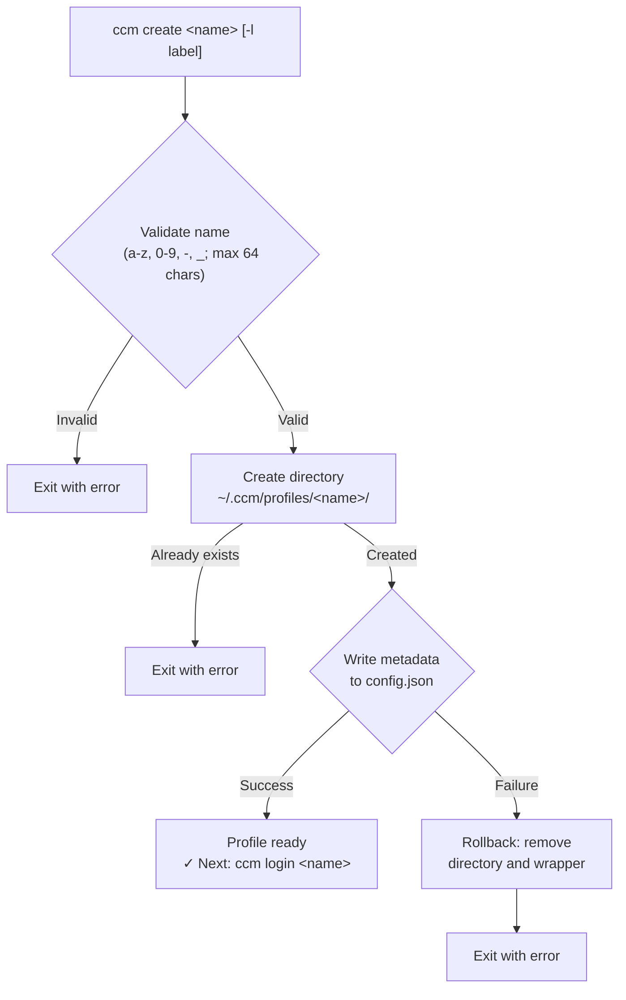
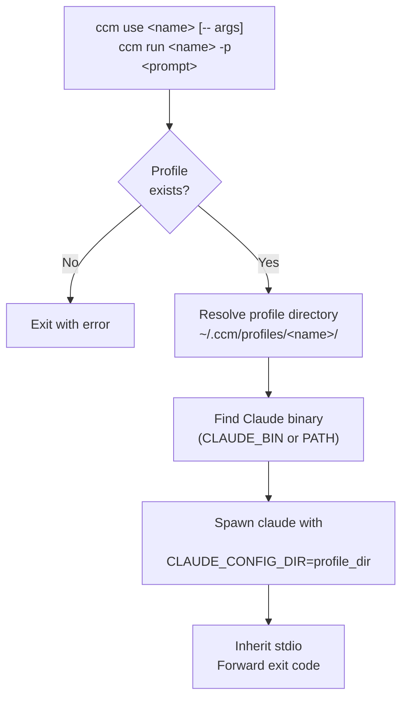
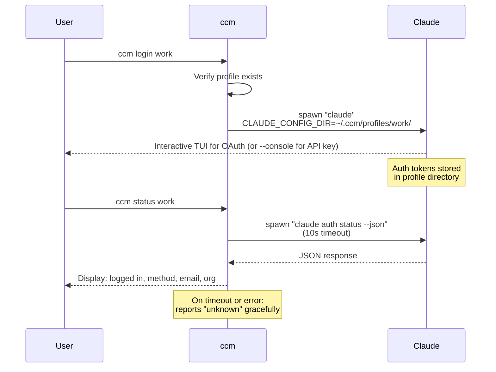
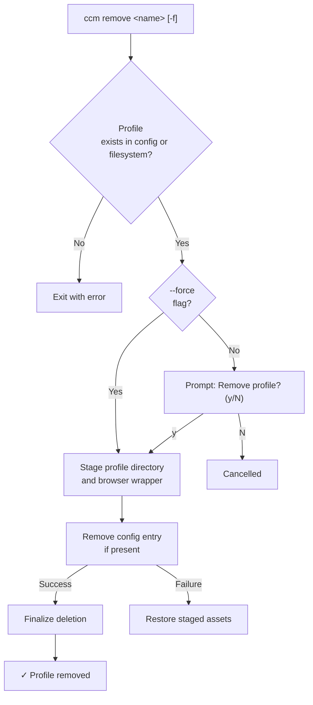

# ccm

> Multi-profile manager for Claude Code

[](https://github.com/remeic/ccm-cli/actions/workflows/ci.yml)
[](https://www.npmjs.com/package/@remeic/ccm)
[](LICENSE)
[](https://nodejs.org)
[](https://codecov.io/github/Remeic/ccm-cli)
[](https://stryker-mutator.io/)

Switch between Claude Code accounts instantly. Like `nvm` for Claude Code profiles.

## Table of Contents

- [Why](#why)
- [Prerequisites](#prerequisites)
- [Install](#install)
- [Quick Start](#quick-start)
- [Commands](#commands)
- [How It Works](#how-it-works)
  - [Architecture Overview](#architecture-overview)
  - [Profile Isolation](#profile-isolation)
  - [Profile Lifecycle](#profile-lifecycle)
  - [Launching Claude](#launching-claude)
  - [Authentication](#authentication)
  - [Removing Profiles](#removing-profiles)
  - [Config Persistence](#config-persistence)
  - [Claude Binary Discovery](#claude-binary-discovery)
- [Configuration](#configuration)
- [Privacy](#privacy)
- [Comparison](#comparison)
- [FAQ](#faq)
- [Contributing](#contributing)
- [License](#license)

## Why

Claude Code stores authentication in a single config directory. If you use multiple Anthropic accounts (personal, work, client projects), you need to log out and back in every time you switch. **ccm** manages isolated profile directories so you can switch instantly — or run multiple accounts simultaneously.

## Prerequisites

- [Node.js](https://nodejs.org) >= 18
- [Claude Code](https://docs.anthropic.com/en/docs/claude-code) installed and available on your `PATH`

## Install

```sh
npm i -g @remeic/ccm
```

Or run without installing:

```sh
npx @remeic/ccm <command>
```

The installed command remains `ccm`.

## Quick Start

```
$ ccm create work
✓ Profile "work" created
  Next: ccm login work

$ ccm login work
# Opens Claude auth flow in browser...

$ ccm use work
# Launches Claude Code with the "work" profile
```

## Commands

| Command | Description |
|---|---|
| `ccm create <name> [-l label] [-b browser]` | Create a profile. `-b` sets the browser for OAuth |
| `ccm list` | List all profiles with auth status, including drifted entries |
| `ccm use <name> [-- args]` | Launch Claude Code. Args after `--` are passed to Claude |
| `ccm login <name> [--console] [-b browser] [--url-only]` | Authenticate a profile |
| `ccm status [name]` | Show auth status and storage state for one or all profiles |
| `ccm remove <name> [-f]` | Remove a profile. `-f` skips confirmation |
| `ccm run <name> -p <prompt>` | Run a prompt non-interactively |

## Passing Flags and Environment Variables

Everything after `--` in `ccm use` is forwarded to `claude`. Env vars from your shell are inherited.

```bash
# Pass flags
ccm use work -- --dangerously-skip-permissions

# Env vars + flags
CLAUDE_CODE_EXPERIMENTAL_AGENT_TEAMS=1 ccm use work -- --dangerously-skip-permissions

# Non-interactive with env vars
CLAUDE_CODE_EXPERIMENTAL_AGENT_TEAMS=1 ccm run work -p "explain this codebase"
```

For combos you use often, set up shell aliases:

```bash
# ~/.zshrc or ~/.bashrc
alias cwork='CLAUDE_CODE_EXPERIMENTAL_AGENT_TEAMS=1 ccm use work -- --dangerously-skip-permissions'
alias cpersonal='ccm use personal -- --dangerously-skip-permissions'
```

## Multi-Account Login

Each profile has isolated auth. Claude Code manages credentials in macOS Keychain; ccm stores nothing.

`ccm login` launches the interactive Claude TUI which supports both auto-redirect (localhost callback) and manual code paste.

### Different Browser per Profile

```bash
# Specify browser for this login
ccm login work --browser firefox

# Persist browser in the profile
ccm create work --browser "/Applications/Google Chrome.app/Contents/MacOS/Google Chrome"
ccm login work  # always opens Chrome

# Chrome with a specific profile directory
ccm create client --browser "/Applications/Google Chrome.app/Contents/MacOS/Google Chrome --profile-directory=Profile\ 2"
```

### URL-Only Mode

```bash
ccm login work --url-only
```

Suppresses auto-opening a browser. Claude prints the auth URL — copy it, open in whichever browser you want. After ~3 seconds the TUI shows "Paste code here if prompted >" where you paste the code from the browser.

### API Key Auth

```bash
ccm login work --console
```

## How It Works

### Architecture Overview

ccm stores all data under `~/.ccm/`:

```
~/.ccm/
├── config.json              # Profile metadata (name, label, createdAt)
├── browsers/                # Browser wrapper scripts (when browser has args)
└── profiles/
    ├── work/                # Isolated Claude config directory
    └── personal/            # Isolated Claude config directory
```

Each profile directory acts as a standalone Claude Code config directory. A central `config.json` tracks metadata. Runtime dependencies are [Commander.js](https://github.com/tj/commander.js) for CLI parsing and [Zod](https://zod.dev) for schema validation and type inference; everything else uses Node.js built-ins.

Source code follows a clean separation between library logic and CLI wiring:

```
src/
├── index.ts                 # Entry point — registers all commands
├── types.ts                 # Zod schemas and inferred TypeScript types
├── lib/
│   ├── constants.ts         # Path constants (~/.ccm, profiles dir, config file)
│   ├── config.ts            # Config file I/O with atomic writes
│   ├── profiles.ts          # Profile directory management and validation
│   ├── profile-store.ts     # Reconciled config/filesystem profile view
│   ├── claude.ts            # Claude binary discovery, spawning, auth status
│   └── browsers.ts          # Browser wrapper generation and validation
└── commands/
    ├── create.ts            # Create profile (with rollback on failure)
    ├── list.ts              # List profiles with auth status and drift state
    ├── login.ts             # Authenticate via Claude TUI or --console
    ├── use.ts               # Launch Claude with profile config dir
    ├── status.ts            # Show auth status and drift state
    ├── remove.ts            # Remove profile with staged rollback
    └── run.ts               # Run prompt with specific profile
```

### Profile Isolation

Claude Code reads auth tokens, settings, and project data from whatever directory `CLAUDE_CONFIG_DIR` points to. ccm exploits this by creating a separate directory per profile and setting this environment variable when spawning Claude:

```ts
spawn(claudeBinary, args, {
  env: { ...process.env, CLAUDE_CONFIG_DIR: profileDir },
  stdio: 'inherit',
})
```

No symlinks, no file copying, no modification of Claude's own config directory. Profiles are fully independent — logging in with one profile does not affect another. You can run multiple profiles simultaneously in different terminals.

### Profile Lifecycle

When you create a profile, ccm validates the name, creates the directory, creates a browser wrapper if needed, and writes metadata to `config.json`. If the config write fails, any partially created on-disk state is rolled back.



Profile names must match `[a-zA-Z0-9_-]+` and cannot exceed 64 characters.

`ccm list` and `ccm status` reconcile `config.json` with `~/.ccm/profiles/` instead of trusting just one source. Each profile is surfaced with one of these states:

- `ready`: config entry and profile directory both exist
- `orphaned`: directory exists but metadata is missing from `config.json`
- `config-only`: metadata exists but the profile directory is missing

### Launching Claude

Both `ccm use` and `ccm run` resolve the profile directory, locate the Claude binary, and spawn it with the isolated config.



`use` launches an interactive Claude session. Any args after `--` are passed through directly. `run` sends a prompt non-interactively via `-p`.

### Authentication

Login delegates entirely to Claude's own auth flow. OAuth launches the interactive Claude TUI directly; `--console` uses `claude auth login --console`. Status checks use `claude auth status --json` with a 10-second timeout.



The `--console` flag on `login` enables API key authentication instead of the browser flow.

### Removing Profiles

Removal deletes the config entry, the profile directory, and any browser wrapper script. By default, it asks for confirmation.

To avoid leaving config and filesystem out of sync, removal is staged: ccm temporarily renames on-disk assets, updates `config.json`, and only then finalizes deletion. If the config update fails, the staged assets are restored.



### Config Persistence

ccm uses an atomic write pattern to prevent config corruption. Data is written to a temporary file, then atomically renamed:

```ts
const tmp = `${configFile}.tmp`
writeFileSync(tmp, JSON.stringify(config, null, 2))
renameSync(tmp, configFile)  // Atomic on POSIX filesystems
```

If the process crashes mid-write, the original config file remains intact. The config schema:

```json
{
  "profiles": {
    "work": {
      "name": "work",
      "label": "Work account",
      "browser": "/path/to/browser",
      "createdAt": "2025-03-15T10:30:00.000Z"
    }
  }
}
```

On read errors (missing file, malformed JSON, invalid structure), ccm gracefully falls back to a default empty config rather than crashing.

### Claude Binary Discovery

ccm locates the Claude binary using the following strategy:

1. Check the `CLAUDE_BIN` environment variable (explicit override)
2. Use `which claude` (Unix/macOS) or `where claude` (Windows) to search `PATH`
3. If neither succeeds, exit with a clear installation message

## Configuration

| Variable | Description |
|---|---|
| `CLAUDE_BIN` | Override the path to the Claude binary. Useful if Claude is installed in a non-standard location |

All ccm data is stored in `~/.ccm/`. This includes the config file and all profile directories.

## Privacy

**ccm does not collect, store, or transmit any user data.** There is no telemetry, no analytics, no network calls of any kind.

Everything stays on your machine:

- **Profile metadata** (name, label, creation date) is stored locally in `~/.ccm/config.json`
- **Auth tokens** are managed entirely by Claude Code inside each profile directory — ccm never reads or touches them
- **No outbound connections** — ccm only spawns the local Claude binary, it never contacts any remote server

You can verify this yourself: the runtime dependencies are [Commander.js](https://github.com/tj/commander.js) for CLI parsing and [Zod](https://zod.dev) for schema validation and type inference, and the CLI still makes zero HTTP requests.

## Comparison

| | Without ccm | With ccm |
|---|---|---|
| Switch accounts | `claude auth logout` then `claude auth login` | `ccm use work` |
| Multiple sessions | Not possible simultaneously | Each profile runs independently |
| Config mixing risk | High — single config directory | None — full isolation |
| Setup per account | Manual every time | One-time `create` + `login` |

## FAQ

**Can I use two profiles at the same time?**

Yes. Each profile has its own config directory. Run `ccm use work` in one terminal and `ccm use personal` in another — they are fully independent.

**Does ccm modify Claude Code itself?**

No. ccm only sets the `CLAUDE_CONFIG_DIR` environment variable when spawning Claude. It never modifies Claude's files or installation.

**What happens if I delete `~/.ccm/`?**

All profiles and their auth tokens are lost. Claude Code itself is unaffected.

**Is Windows supported?**

ccm uses cross-platform binary discovery (`which`/`where`) and standard Node.js filesystem APIs. It works on macOS, Linux, and Windows.

## Contributing

See [CONTRIBUTING.md](CONTRIBUTING.md).

## License

[MIT](LICENSE)
